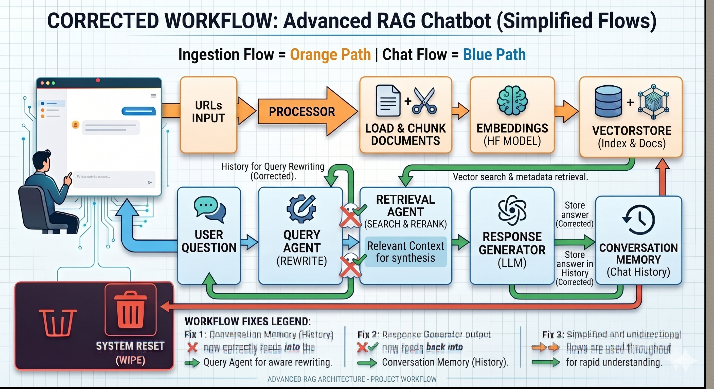
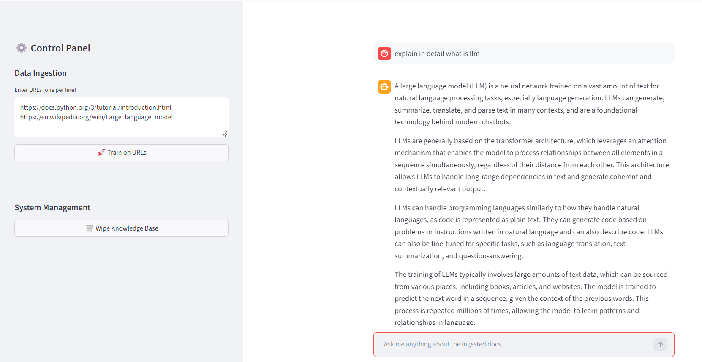

# 🤖 Corporate AI Assistant — Advanced Agentic RAG System

<div align="center">


### High-Precision Agentic RAG System with Query Rewriting, Hybrid Retrieval, Neural Reranking & Strict Grounding Guardrails

</div>

---

# 📌 Project Overview

This project is an **Advanced Retrieval-Augmented Generation (RAG) System** designed to function as a secure and highly accurate private knowledge assistant for corporate environments.

Unlike traditional chatbots, this platform uses an **Agentic RAG Workflow** capable of:

- Query decomposition
- Hybrid semantic + keyword retrieval
- Neural reranking
- Strict grounding validation
- Session-aware memory
- Atomic system reset

The system ensures that all responses are generated strictly from user-provided documentation while minimizing hallucinations and irrelevant outputs.

---

# ❗ Problem Statement

Modern AI systems often face critical limitations in enterprise environments.

## ⚠️ Key Challenges

### 🔹 Hallucinated Responses
LLMs frequently generate inaccurate answers not grounded in company-specific documentation.

### 🔹 Poor Multi-Hop Reasoning
Basic RAG systems fail to handle complex questions requiring decomposition into smaller searchable tasks.

### 🔹 Memory Persistence & Data Leakage
Deleting vector databases alone does not guarantee complete removal of context from active system memory.

### 🔹 Weak Grounding Mechanisms
Most systems continue generating responses even when relevant information is unavailable.

---

# 💡 Solution Approach

The project implements a **Shielded Agentic RAG Architecture** to ensure:

- High retrieval precision
- Contextual reasoning
- Secure memory management
- Reliable grounded generation

---

## 🧠 Core Architectural Innovations

### 🔹 Agentic Query Transformation
A dedicated Query Agent rewrites and decomposes user prompts into optimized sub-queries for improved retrieval coverage.

### 🔹 Hybrid Retrieval Engine
The system combines:

- **FAISS Vector Search** → Semantic similarity retrieval
- **BM25 Retrieval** → Exact keyword matching

### 🔹 Neural Reranking Pipeline
A Cross-Encoder reranks retrieved documents based on semantic relevance to eliminate noisy retrievals.

### 🔹 Strict Grounding Guardrails
If retrieval confidence falls below a predefined threshold, the system refuses to answer instead of hallucinating.

### 🔹 Stateful Conversation Memory
The system maintains context-aware conversational memory for follow-up interactions.

### 🔹 Atomic Reset Protocol
A one-click wipe mechanism deletes:

- Physical vector databases
- Metadata stores
- Active in-memory chains
- Session states

ensuring zero residual memory leakage.

---

# ✨ Key Features

- 🤖 Agentic Query Decomposition
- 🔍 Hybrid Semantic + Keyword Retrieval
- 🧠 Neural Cross-Encoder Reranking
- 🛡️ Strict Grounding Guardrails
- 🧹 One-Click Atomic Reset
- 💬 Session-Aware Conversational Memory
- 📚 Professional Source Attribution
- ⚡ High-Speed LLM Inference using Groq
- 📄 Context-Aware Answer Generation
- 🏗️ Enterprise-Style Modular Architecture

---

# ⚙️ Tech Stack

## 🖥️ Backend & AI

- Python 3.9+
- FastAPI
- LangChain
- FAISS
- BM25 Retrieval
- Hugging Face Transformers
- Sentence Transformers
- Pydantic
- Groq API

---

## 🎨 Frontend

- Streamlit
- Requests
- Interactive Chat Dashboard

---

## 🧠 AI & Retrieval

- Retrieval-Augmented Generation (RAG)
- Agentic Query Rewriting
- Cross-Encoder Reranking
- Semantic Search
- Hybrid Retrieval Systems

---

# 🏗️ System Architecture

The platform follows a modular multi-layered architecture separating ingestion, retrieval, reranking, grounding, and generation pipelines.

---

## 📌 Architecture Diagram

<p align="center">
  
</p>

---

# 🖥️ User Interface

## 📌 Application Dashboard

<p align="center">
  
</p>

---

# 🔄 Workflow / Pipeline

The platform operates through three primary automated workflows.

---

# 1️⃣ Data Ingestion Pipeline

This workflow transforms raw web documentation into a searchable knowledge base.

## Steps

### 🔹 URL Extraction
The system fetches and parses web content from provided URLs.

### 🔹 Content Preprocessing
HTML boilerplate, ads, navigation bars, and irrelevant text are removed.

### 🔹 Recursive Chunking
Documents are divided into semantically meaningful chunks with overlap preservation.

### 🔹 Embedding Generation
Each chunk is converted into high-dimensional vector embeddings.

### 🔹 Dual Indexing

#### FAISS
Stores vector embeddings for semantic similarity retrieval.

#### BM25
Stores keyword indexes for exact lexical matching.

---

# 2️⃣ Agentic Inference Pipeline

When the user submits a query, the system triggers an intelligent multi-stage reasoning pipeline.

---

## Steps

### 🔹 Query Transformation
The Query Agent rewrites and decomposes the user query into optimized retrieval tasks.

### 🔹 Hybrid Retrieval
The system simultaneously queries:

- FAISS Vector Index
- BM25 Keyword Index

### 🔹 Neural Reranking
A Cross-Encoder model reranks all retrieved documents based on semantic relevance.

### 🔹 Grounding Validation
If relevance confidence is below threshold, the system blocks response generation.

### 🔹 Contextual Answer Synthesis
The LLM generates a grounded response using only retrieved context.

### 🔹 Source Attribution
Relevant source URLs are automatically appended to the final response.

---

# 3️⃣ System Management Pipeline

## 🔹 Atomic Reset Flow

The reset controller:

- Deletes vectorstore directories
- Clears metadata stores
- Reinitializes in-memory chains
- Removes session states

ensuring a fully clean system state.

---

# 🚀 Installation & Setup

# 1️⃣ Prerequisites

Ensure the following are installed:

- Python 3.9+
- Git
- Groq API Key

---

# 2️⃣ Clone Repository

```bash
git clone https://github.com/moharir-aniruddha/Advanced_RAG.git
```

---

# 3️⃣ Create Virtual Environment

## Windows

```bash
python -m venv venv
venv\Scripts\activate
```

## macOS / Linux

```bash
python -m venv venv
source venv/bin/activate
```

---

# 4️⃣ Install Dependencies

```bash
pip install -r requirements.txt
```

---

# 5️⃣ Configure Environment Variables

Create a `.env` file in the root directory.

```env
GROQ_API_KEY=your_groq_api_key_here
```

---

# ▶️ Run the Application

## Step A — Start FastAPI Backend

```bash
python -m api.main_api
```

---

## Step B — Start Streamlit Frontend

```bash
streamlit run ui/app.py
```

---

# 🧠 Advanced Concepts Used

| Concept | Description |
|---|---|
| Agentic RAG | Multi-stage intelligent retrieval workflow |
| Query Rewriting | Converts user queries into optimized retrieval tasks |
| Hybrid Retrieval | Combines semantic + keyword search |
| Cross-Encoder Reranking | Neural reranking for precision retrieval |
| Grounding Guardrails | Blocks hallucinated responses |
| Vector Search | Semantic similarity retrieval using embeddings |
| BM25 Retrieval | Exact keyword-based search |
| Stateful Memory | Context-aware conversational sessions |
| Atomic Reset | Complete storage + memory purge |

---

# 📊 Why This Project Stands Out

## ✅ Enterprise-Grade AI Engineering Concepts

- Advanced Agentic RAG Pipeline
- Hallucination Prevention Mechanisms
- Enterprise Memory Isolation
- Production-Style Modular Architecture
- High Retrieval Accuracy
- Real-World AI System Design

---


</div>
